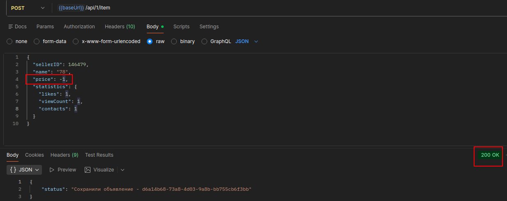
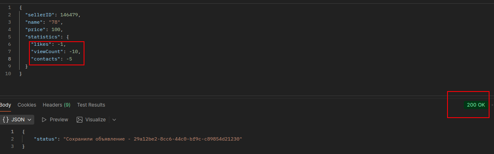
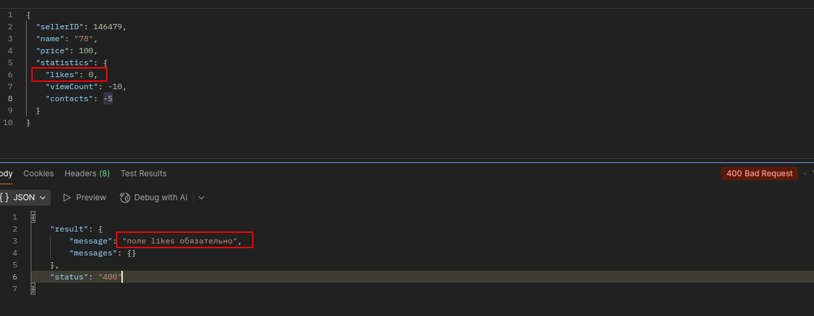

### Список дефектов

|                       | Баг-репорт1                                                                                                                                                                                                                                                                               |
|-----------------------|------------------------------------------------------------------------------------------------------------------------------------------------------------------------------------------------------------------------------------------------------------------------------------------|
| Название              | Создание объявления с отрицательной ценой                                                                                                                                                                                                                                                |
| Описание              | API позволяет создать объявление с отрицательным значением поля  price, что противоречит бизнес-логике (цена не может быть отрицательной)                                                                                                                                                |
| Предусловия           | API доступно. Эндпоинт:  POST /api/1/item                                                                                                                                                                                                                                                 |
| Шаги воспроизведения  | 1. Выполнить запрос:   ``` curl -X POST https://qa-internship.avito.com/api/1/item \ -H "Content-Type: application/json" \ -d '{   "sellerID": 151962,   "name": "Персидский котёнок",   "price": -1,   "statistics": {     "likes": 1,     "viewCount": 1,     "contacts": 1   }    ``` |
| Фактический результат | Объявление успешно создаётся:    200 OK   ```{ "status": "Сохранили объявление - <uuid>"```                                                                                                                                                                                              |
| Ожидаемый результат   | 400 Bad Reques   ```{      "result" :   {          "message" :   "поле price не может быть отрицательным" ,          "messages" :   {}      },      "status" :   "400" } ```                                                                                                                           |
| Серьёзность           | High                                                                                                                                                                                                                                                                                     |
| Приоритет             | P0 — критический                                                                                                                                                                                                                                                                         |
| Окружение             | URL: https://qa-internship.avito.com. Метод: POST. Content-Type: application/json                                                                                                                                                                                                        |
| Дополнительно         |                                                                                                                                                                                                                                                             |

|                       | Баг-репорт2                                                                                                                                                                                                                                                                                   |
|-----------------------|-----------------------------------------------------------------------------------------------------------------------------------------------------------------------------------------------------------------------------------------------------------------------------------------------|
| Название              | Создание объявления с отрицательными значениями в statistics (likes, viewCount, contacts)                                                                                                                                                                                                     |
| Описание              | API позволяет создавать объявление с отрицательными значениями полей  likes ,  viewCount ,  contacts, что противоречит бизнес-логике (метрики не могут быть отрицательными).                                                                                                                  |
| Предусловия           | API доступно. Эндпоинт:  POST /api/1/item                                                                                                                                                                                                                                                      |
| Шаги воспроизведения  | 1. Выполнить запрос:   ``` curl -X POST https://qa-internship.avito.com/api/1/item \ -H "Content-Type: application/json" \ -d '{   "sellerID": 151962,   "name": "Персидский котёнок",   "price": 100,   "statistics": {     "likes": -1,     "viewCount": -5,     "contacts": -10   }    ``` |
| Фактический результат | Объявление успешно создаётся:    200 OK   ```{ "status": "Сохранили объявление - <uuid>"```                                                                                                                                                                                                   |
| Ожидаемый результат   | 400 Bad Reques   ```{      "result" :   {          "message" :   "" ,          "messages" :   {}      },      "status" :   "не передано тело объявления" } ```  или "message": "поля statistics не могут быть отрицательными".                                                                |
| Серьёзность           | High                                                                                                                                                                                                                                                                                          |
| Приоритет             | P0 — критический                                                                                                                                                                                                                                                                              |
| Окружение             | URL: https://qa-internship.avito.com. Метод: POST. Content-Type: application/json                                                                                                                                                                                                             |
| Дополнительно         |                                                                                                                                                                                                                                                              |

|                       | Баг-репорт3                                                                                                                                                                                                                                                                               |
|-----------------------|-------------------------------------------------------------------------------------------------------------------------------------------------------------------------------------------------------------------------------------------------------------------------------------------|
| Название              | Некорректная обработка нулевых значений в statistics (0 воспринимается как отсутствие поля)                                                                                                                                                                                               |
| Описание              | API возвращает ошибку при передаче значений  0  в полях  likes ,  viewCount ,  contacts .  Сервер некорректно обрабатывает  0  как отсутствие значения, хотя  0 является валидным значением.                                                                                              |
| Предусловия           | API доступно. Эндпоинт:  POST /api/1/item                                                                                                                                                                                                                                                  |
| Шаги воспроизведения  | 1. Выполнить запрос:   ``` curl -X POST https://qa-internship.avito.com/api/1/item \ -H "Content-Type: application/json" \ -d '{   "sellerID": 151962,   "name": "Персидский котёнок",   "price": 100,   "statistics": {     "likes": 0,     "viewCount": 2,     "contacts": 1   }    ``` |
| Фактический результат | 400 Bad Reques  ```{      "result" :   {          "message" :   "поле likes обязательно" ,          "messages" :   {}      },      "status" :   "400" }```                                                                                                                                |
| Ожидаемый результат   | 200 OK   ```{ "status": "Сохранили объявление - <uuid>"```                                                                                                                                                                                                                                |
| Серьёзность           | High                                                                                                                                                                                                                                                                                      |
| Приоритет             | P0 — критический                                                                                                                                                                                                                                                                          |
| Окружение             | URL: https://qa-internship.avito.com. Метод: POST. Content-Type: application/json                                                                                                                                                                                                         |
| Дополнительно         |                                                                                                                                                                                                                                                          |
