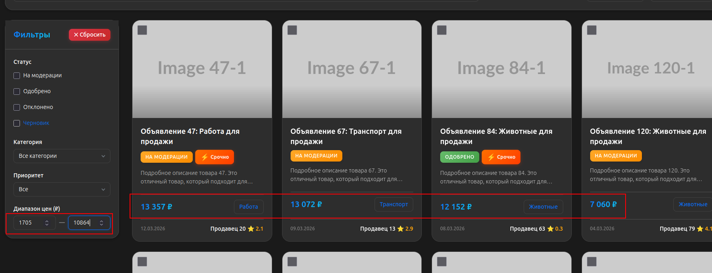
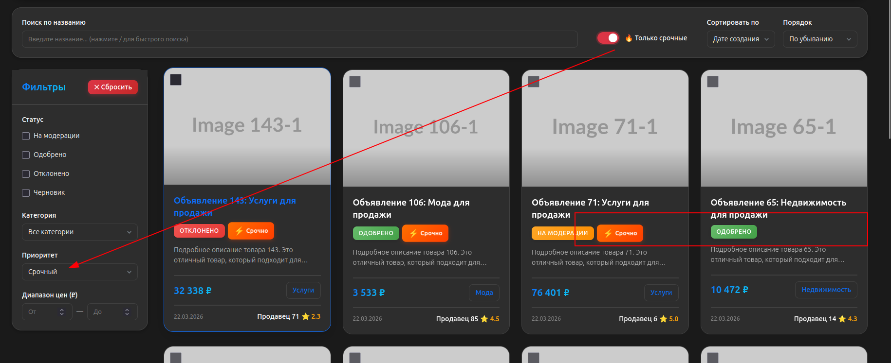
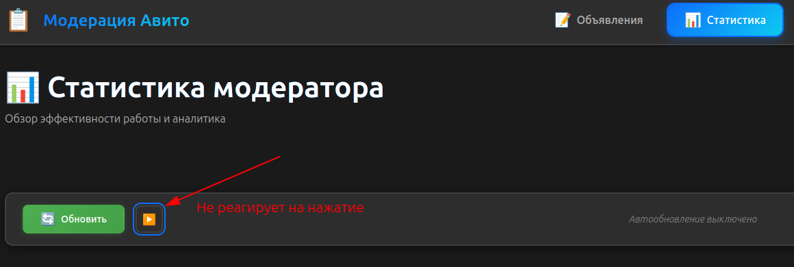
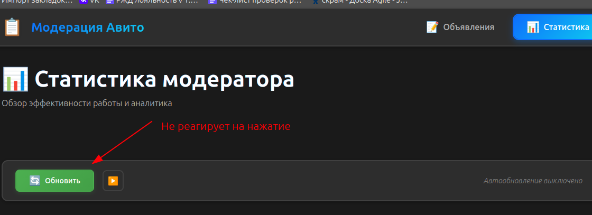

|                       | Баг-репорт1                                                                                                                                                                         |
|-----------------------|-------------------------------------------------------------------------------------------------------------------------------------------------------------------------------------|
| Название              | Некорректная работа фильтра "Диапазон цен" на главной странице модерации объявлений                                                                                                 |
| Описание              | Фильтр "Диапазон цен" на странице списка объявлений работает некорректно. При задании диапазона значений отображаются объявления, цена которых не соответствует указанным границам. |
| Предусловия           | Пользователь находится на странице списка объявлений https://cerulean-praline-8e5aa6.netlify.app/list                                                                               |
| Шаги воспроизведения  | <ol>  <li>На странице списка объявлений в фильтре "Диапазон цен": вести "От": 1705, ввести "До": 10864.</li>  <li>Дождаться обновления списка.</li> </ol>                           |
| Фактический результат | Отображаются объявления с ценами вне заданного диапазона                                                                                                                            |
| Ожидаемый результат   | Отображаются только объявления в диапазоне 1705–10864 (включительно).                                                                                                               |
| Серьезность           | High                                                                                                                                                                                |
| Приоритет             | P0 — критический                                                                                                                                                                    |
| Окружение             | URL: https://cerulean-praline-8e5aa6.netlify.app/list. Браузер: Firefox. ОС: Linux                                                                                                  |
| Дополнительно         |                                                                                                                                                    |

|                       | Баг-репорт2                                                                                                                                                                                                                                                                     |
|-----------------------|---------------------------------------------------------------------------------------------------------------------------------------------------------------------------------------------------------------------------------------------------------------------------------|
| Название              | Тогл "Только срочные" не работает на главной страницемодерации объявлений                                                                                                                                                                                                       |
| Описание              | Переключатель "Только срочные" на странице списка объявлений не влияет на состояние страницы. При его включении список объявлений не фильтруется, объявления без пометки "Срочно" продолжают отображаться. Функциональность фильтрации по срочным объявлениям неработоспособна. |
| Предусловия           | Пользователь находится на странице:  https://cerulean-praline-8e5aa6.netlify.app/list . В системе присутствуют объявления с признаком "Срочно" и без него                                                                                                                       |
| Шаги воспроизведения  | <ol> <li>В верхнем меню найти переключатель "Только срочные".</li> <li>Включить переключатель.</li> <li>Дождаться обновления списка объявлений.</li>  </ol>                                                                                                                     |
| Фактический результат | Список объявлений не изменяется. Объявления не фильтруются.                                                                                                                                                                                                                     |
| Ожидаемый результат   | <ol>  <li>Переключатель активируется</li> <li> Поле "Приоритет" автоматически заполняется значением "Срочный"</li>  <li>В списке отображаются только объявления с пометкой "Срочно"</li> <li> Фильтрация применяется ко всем страницам</li>  </ol>                              |
| Серьезность           | High                                                                                                                                                                                                                                                                            |
| Приоритет             | P0 — критический                                                                                                                                                                                                                                                                |
| Окружение             | URL: https://cerulean-praline-8e5aa6.netlify.app/list. Браузер: Firefox. ОС: Linux                                                                                                                                                                                              |
| Дополнительно         |                                                                                                                                                                                                                                                |

|                       | Баг-репорт3                                                                                                                                         |
|-----------------------|-----------------------------------------------------------------------------------------------------------------------------------------------------|
| Название              | На странице статистики кнопка запуска таймера не работает после его остановки                                                                       |
| Описание              | После остановки таймера невозможно запустить его повторно. Кнопка запуска (треугольник) не реагирует на нажатие, автообновление не возобновляется.  |
| Предусловия           | Пользователь находится на странице:   https://cerulean-praline-8e5aa6.netlify.app/stats                                                             |
| Шаги воспроизведения  | <ol> <li>Нажать кнопку остановки таймера ("\|\|")</li> <li>Нажать на эту же кнопку для запуска таймера (кнопка поменяла состояние).</li>  </ol>     |
| Фактический результат | Кнопка с остановки таймера поеняла состояние на запуск таймера. Таймер не запускается.                                                              |
| Ожидаемый результат   | Кнопка с остановки таймера поеняла состояние на запуск таймера. После нажатия на кнопку запуска таймера - автообновление статистики возобновляется. |
| Серьезность           | High                                                                                                                                                |
| Приоритет             | P0 — критический                                                                                                                                    |
| Окружение             | URL: https://cerulean-praline-8e5aa6.netlify.app/stats. Браузер: Firefox. ОС: Linux                                                                 |
| Дополнительно         |                                                                                                                    |

|                       | Баг-репорт4                                                                                                         |
|-----------------------|---------------------------------------------------------------------------------------------------------------------|
| Название              | На странице статистики кнопка "Обновить" не работает после остановки таймера                                        |
| Описание              | После остановки таймера кнопка "Обновить" перестает работать. Нажатие не приводит к обновлению данных.              |
| Предусловия           | Пользователь находится на странице: https://cerulean-praline-8e5aa6.netlify.app/stats. Таймер ранее был остановлен. |
| Шаги воспроизведения: | <ol> <li>Нажать кнопку остановки таймера ("\|\|")</li>  <li>Нажать кнопку "Обновить"</li>  </ol>                    |
| Фактический результат | Обновление не происходит                                                                                            |
| Ожидаемый результат   | Данные обновляются независимо от состояния таймера                                                                  |
| Серьёзность           | High                                                                                                                |
| Приоритет             | P0 — критический                                                                                                    |
| Окружение             | URL: https://cerulean-praline-8e5aa6.netlify.app/stats. Браузер: Firefox. ОС: Linux                                 |
| Дополнительно         |                                                                                |

